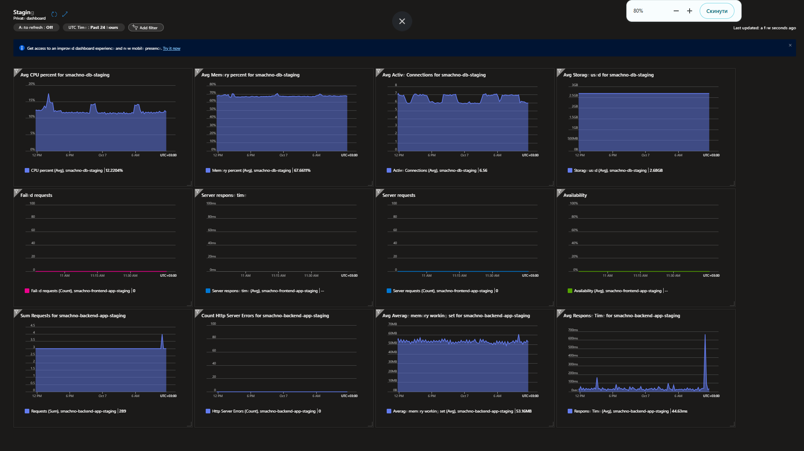
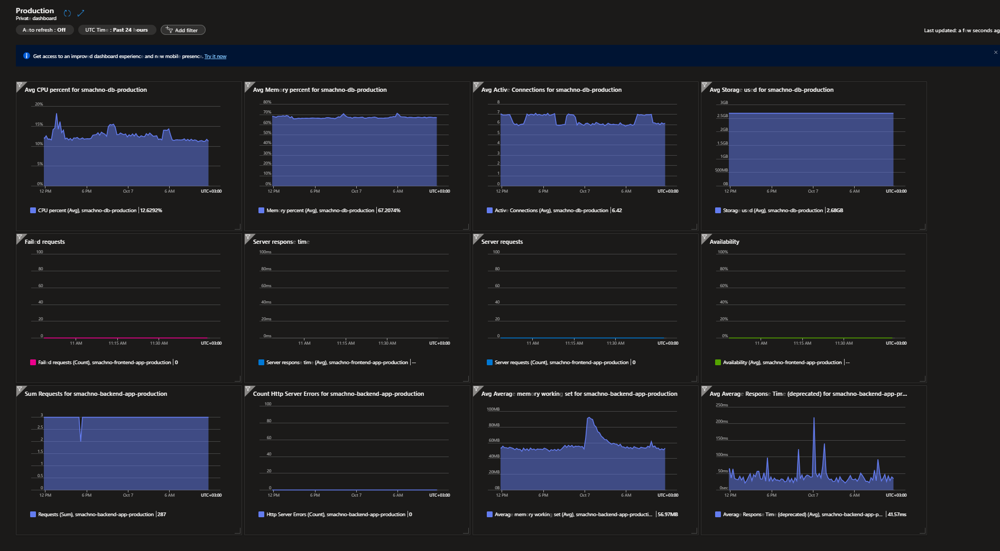

# CulinaryPlatform - Infrastructure and CI/CD
This document details the infrastructure of the CulinaryPlatform on Azure, deployed using Terraform, and outlines the continuous integration and continuous deployment (CI/CD) strategy powered by GitHub Actions.

## 1. Architecture and Infrastructure (Terraform)
The infrastructure is deployed within a specified resource group `(staging / production)` in the `northeurope` region, focusing on private networking isolation for the database layer.

### 1.1. Networking Resources
The networking topology is defined in the `network.tf` file:
* Virtual Network (VNet): `culinary-vnet (10.0.0.0/16).`
* Subnets:
  * `app-subnet (10.0.1.0/24)`: Delegated for Azure Web Apps.
  * `postgresql-subnet (10.0.2.0/24)`: Delegated for PostgreSQL Flexible Server.
* Private DNS Zone: `privatelink.postgres.database.azure.com`, linked to the VNet for secure access.

### 1.2. Compute and Data Storage
* Configuration is defined in the `main.tf` file:
* App Service Plan: A shared plan (B_Standard_B1ms SKU, Linux) is used for both applications. Note the SKU is BStandard
* App Service (Backend): Azure Linux Web App, integrated into the `app-subnet`.
* App Service (Frontend): Azure Linux Web App, integrated into the `app-subnet`, with `always_on = true` enabled.
* PostgreSQL Flexible Server:
  * Version `14`.
  * Private Access: Public network access is disabled `(public_network_access_enabled = false)`. Access is strictly limited to the VNet private network.

## 2. CI/CD Process and Branching Strategy
Application deployment and infrastructure management are fully automated using GitHub Actions.

### 2.1. Required GitHub Secrets (MANDATORY)
The following secrets **MUST** be added to the GitHub repository settings for successful execution of all CI/CD pipelines.

| Secret Name   | Purpose       |
| ------------- | ------------- |
| `DBLOGIN` | PostgreSQL administrator login (used by applications).  |
| `DBPASSWORD`  | PostgreSQL administrator password (used by applications). |
| `AZURE_CLIENT_ID` | Client ID for the Azure Service Principal.  |
| `AZURE_CLIENT_SECRET` | Client Secret for the Azure Service Principal. |
| `AZURE_SUBSCRIPTION_ID` | Azure Subscription ID.  |
|`AZURE_TENANT_ID`| Azure Tenant ID. |
|`AZURE_PUBLISH_PROFILE_FRONTEND_STAGING` | Publish Profile for the **Staging** Frontend App Service.  |
| `AZURE_PUBLISH_PROFILE_BACKEND_STAGING`  | Publish Profile for the **Staging** Backend App Service. |
|`AZURE_PUBLISH_PROFILE_FRONTEND_PROD` | Publish Profile for the **Production** Frontend App Service.  |
| `AZURE_PUBLISH_PROFILE_BACKEND_PROD`  | Publish Profile for the **Production** Backend App Service. |

### 2.2. Branch Strategy (Modified GitHub Flow)
1. **Staging Environment**
    * **Testing:** **Create a Pull Request (PR)** targeting the `staging` branch.
    * **Deployment (CD):** Merging into `staging` triggers deployment to the Staging environment.
2. **Production Environment**
    * **Promotion:** Merge the `staging` branch into the `main` branch.
    * **Deployment** (CD): Changes in `main` are deployed to Production.
>  [!IMPORTANT]
>  The main branch must only receive changes from the staging branch. This ensures a successful promotion flow.

### 2.3. Infrastructure Management (Terraform CI/CD)
Deployment (`apply`) and Destruction (`destroy`) of the Terraform infrastructure MUST be performed <ins>manually</ins> through the GitHub Actions interface using the `workflow_dispatch` trigger.
## 3. Environment Configuration and Monitoring

### 3.1. Azure Web App Environment Variables
Variables added to facilitate the build process using Oryx:
* `ENABLE_ORYX_BUILD: true`
* `SCM_DO_BUILD_DURING_DEPLOYMENT: true`

### 3.2. CORS Policy
A **CORS** (Cross-Origin Resource Sharing) policy has been added to the **Backend Web App** to allow secure communication with the Frontend.

### 3.3. Monitoring and Alerts (Azure Monitor)
* **Dashboards**: Specialized Azure Monitor dashboards created for
  * `Staging`
    
  * `Production`
    
* **Alerts**: Critical alerts are configured for core resources:
  * **PostgreSQL Flexible Server** (Storage used more that 75 percent).
  * **Web App (Frontend)** (Server exceptions).
  * **Web App (Backend)** (Average Response Time).

